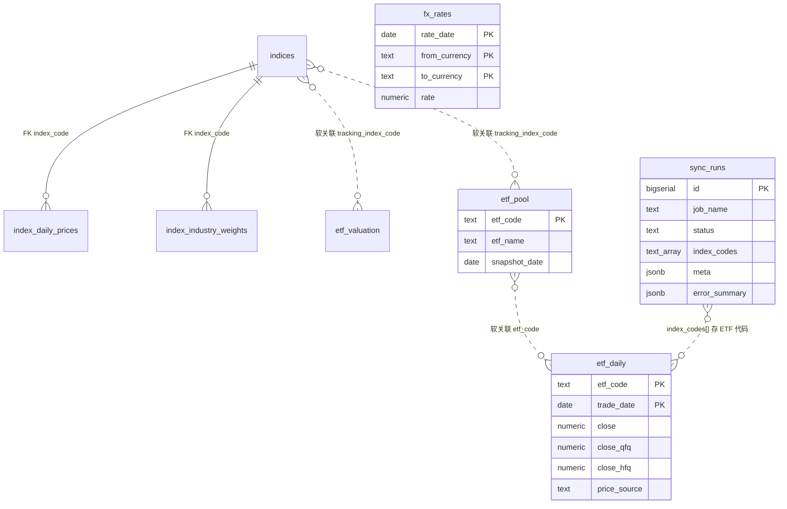

# Supabase 数据库表结构说明

本文档描述当前 Supabase PostgreSQL 实例中的表、视图及关系。

- **指数相关表 / 视图**：定义见 `src/scheduled_tasks/models/schema.sql`。全市场指数链路仍停更；红色火箭 job `sync_hongsehuojian_fill_validate` 可对 allowlist 标的**补缺** `index_daily_prices`，并刷新 `etf_valuation`（当日/5y/10y PE）。
- **ETF 相关表**：定义见 `schema.sql`；`etf_daily` 价格由 `sync_etf_kline_yfinance` 主写；`etf_pool` 只读；`etf_valuation` 可由红色火箭 job 写入；红色火箭可对缺失日 INSERT（`price_source='hongsehuojian'`），不覆盖已有行情行。
- **汇率**：`fx_rates` 由 `sync_fx_rates_frankfurter` 主写（Frankfurter / ECB）。
- **驾驶舱用户账本 12 表**：DDL + RLS 见 `migrations/20260710_cockpit_ledger_and_fx_rates.sql`；**业务行由 `stock-charts` UI 写入**，本仓库不写账本数据。

RLS：

- 账本表：`authenticated` 仅能读写 `user_id = auth.uid()` 的行。
- 已授权共享只读（`authenticated` SELECT；job 经 `DATABASE_URL` 写入）：`fx_rates`、`etf_daily`、`etf_pool`、`indices`、`index_daily_prices`。
- **尚未**在 cockpit migration 中显式 grant / RLS 的共享表：`etf_valuation`、`index_industry_weights`（及依赖它们的指数视图）。客户端若需读，需另补 GRANT/policy。
- `schema.sql` 本身不含完整 RLS；已有库请执行 `20260710_cockpit_ledger_and_fx_rates.sql`，并补跑 `20260718_etf_pool_authenticated_read.sql`（新库 `etf_pool` 只读策略；幂等）。

> 已有库若仍为 `etf_grid_*` 旧名，请先执行：
> `psql "$DATABASE_URL" -f src/scheduled_tasks/models/migrations/20260709_etf_rename_and_adj_columns.sql`

## 概览

| 类型 | 名称                      | 说明                                    | 本方案状态       |
| ---- | ------------------------- | --------------------------------------- | ---------------- |
| 表   | `indices`                 | 指数元数据                              | 红色火箭可 ensure 单行 |
| 表   | `index_daily_prices`      | 指数日收盘价                            | 红色火箭补缺           |
| 表   | `index_industry_weights`  | 指数行业权重（申万分级）                | **红色火箭主写**       |
| 表   | `sync_runs`               | 同步任务执行记录（含 `meta`）           | **写入**         |
| 表   | `etf_pool`                | ETF 当前池（PK=`etf_code`，非历史快照） | **只读**         |
| 表   | `etf_daily`               | ETF 日行情（OHLC + volume + 前/后复权 + 来源） | **主写**         |
| 表   | `etf_valuation` | 跟踪指数估值快照（当日/5y/10y PE）      | **红色火箭可写**    |
| 表   | `fx_rates`                | 日频汇率（USD/CNY/HKD 三角）            | **主写**         |
| 表   | 账本 12 表                | 见 migration；UI 写入                   | **DDL only**     |
| 视图 | `index_latest_snapshot`   | 指数最新快照（价 + `etf_valuation` PE） | 可读 |
| 视图 | `index_detail_snapshot`   | 指数各维度最新日期                      | 可读        |

### 账本 12 表（DDL only）

`portfolio_settings`、`target_allocations`、`etf_instruments`、`positions`、`trade_records`、`cash_flows`、`cash_accounts`、`rebalance_plans`、`grid_plans`、`review_entries`、`decision_logs`、`portfolio`。

领域字段 `FxRate.date` 映射物理列 `fx_rates.rate_date`。

## 实体关系

> **外键 vs 软关联**：仅 `index_daily_prices` / `index_industry_weights` → `indices.code` 为真 FK。
> `etf_pool.tracking_index_code`、`etf_valuation.tracking_index_code`、`etf_daily.etf_code` ↔ `etf_pool.etf_code`、`sync_runs.index_codes[]` 均为按代码的逻辑关联，**库中无 FK**。



---

## 指数表

全市场 TuShare `sync_indices` 链路已删除。红色火箭 job `sync_hongsehuojian_fill_validate`（见 [hongsehuojian-fill-validate.md](./hongsehuojian-fill-validate.md)）可对 allowlist 标的补缺 `indices` / `index_daily_prices`，upsert `etf_valuation`，并以红色火箭主源刷新 `index_industry_weights`。`index_daily_valuations` 已删除（migration `20260717_drop_index_daily_valuations.sql`）；指数视图估值改挂 `etf_valuation`。

### `indices` — 指数元数据

| 列名            | 类型          | 约束                                      | 说明                         |
| --------------- | ------------- | ----------------------------------------- | ---------------------------- |
| `code`          | `text`        | **PK**；格式 `######.SH|.SZ|.CSI`         | 指数代码（含交易所后缀）     |
| `name`          | `text`        | NOT NULL                                  | 名称                         |
| `category`      | `text`        | NOT NULL；非空白                          | 分类                         |
| `display_order` | `integer`     | NOT NULL                                  | 展示排序                     |
| `created_at`    | `timestamptz` | NOT NULL, DEFAULT `now()`                 | 创建时间                     |
| `updated_at`    | `timestamptz` | NOT NULL, DEFAULT `now()`                 | 更新时间                     |

### `index_daily_prices` — 指数日收盘价

| 列名         | 类型            | 约束                              | 说明                    |
| ------------ | --------------- | --------------------------------- | ----------------------- |
| `index_code` | `text`          | **PK**；FK → `indices.code` CASCADE | 指数代码              |
| `trade_date` | `date`          | **PK**                            | 交易日                  |
| `close`      | `numeric(18,4)` | NOT NULL；CHECK `> 0`             | 收盘价                  |
| `created_at` | `timestamptz`   | NOT NULL, DEFAULT `now()`         | 创建时间                |
| `updated_at` | `timestamptz`   | NOT NULL, DEFAULT `now()`         | 更新时间                |

**索引：** `idx_index_daily_prices_trade_date`：`(trade_date DESC)`

### `index_industry_weights` — 指数行业权重

| 列名             | 类型            | 约束                                      | 说明                          |
| ---------------- | --------------- | ----------------------------------------- | ----------------------------- |
| `index_code`     | `text`          | **PK**；FK → `indices.code` CASCADE       | 指数代码                      |
| `as_of_date`     | `date`          | **PK**                                    | 权重生效日                    |
| `sw_level`       | `text`          | **PK**；CHECK ∈ `sw1`/`sw2`/`sw3`         | 申万一级 / 二级 / 三级        |
| `industry_name`  | `text`          | **PK**                                    | 行业名称                      |
| `weight_pct`     | `numeric(10,4)` | NOT NULL；CHECK `(0, 100]`                 | 权重占比（%）                 |
| `created_at`     | `timestamptz`   | NOT NULL, DEFAULT `now()`                 | 创建时间                      |
| `updated_at`     | `timestamptz`   | NOT NULL, DEFAULT `now()`                 | 更新时间                      |

**索引：** `idx_index_industry_weights_as_of_date`：`(as_of_date DESC)`

写入：红色火箭按指数 **删旧写新**（最新一期 sw1/sw2/sw3）。

### 视图 `index_latest_snapshot`

按 `indices.display_order` 输出最新价 + 估值快照（无日估值序列，分位列恒为 null）。

| 列名 | 来源 | 说明 |
| ---- | ---- | ---- |
| `code` / `name` / `category` / `display_order` | `indices` | 元数据 |
| `as_of_date` / `close` | `index_daily_prices` 最新一行 | 最新收盘 |
| `history_high` / `drawdown_from_high_pct` | 历史最高收盘推算 | 相对高点回撤（%） |
| `pe_ttm` | `etf_valuation.current_pe_ttm` | 当日 PE |
| `pe_ttm_avg_5y` / `pe_ttm_avg_10y` | 同快照表 | 近 5y / 10y PE 均值 |
| `valuation_as_of_date` | `etf_valuation.trade_date` | 估值日期 |
| `pe_percentile_*` / `pb*` | 常量 `null` | 已无日估值表，分位不再计算 |

### 视图 `index_detail_snapshot`

| 列名 | 说明 |
| ---- | ---- |
| `code` / `name` / `category` / `display_order` | 元数据 |
| `latest_price_date` | `max(index_daily_prices.trade_date)` |
| `latest_valuation_date` | `etf_valuation.trade_date` |
| `latest_industry_date` | `max(index_industry_weights.as_of_date)` |

---

### `sync_runs` — 同步任务执行记录

| 列名            | 类型          | 约束                      | 说明                                                                      |
| --------------- | ------------- | ------------------------- | ------------------------------------------------------------------------- |
| `id`            | `bigserial`   | **PK**                    | 自增主键                                                                  |
| `job_name`      | `text`        | NOT NULL                  | 如 `sync_etf_kline_yfinance`；历史 run 可能仍为 `sync_etf_kline_baostock` |
| `status`        | `text`        | NOT NULL                  | `running` / `success` / `partial` / `failed`                              |
| `started_at`    | `timestamptz` | NOT NULL, DEFAULT `now()` | 开始时间                                                                  |
| `finished_at`   | `timestamptz` | 可空                      | 结束时间                                                                  |
| `index_codes`   | `text[]`      | NOT NULL, DEFAULT `'{}'`  | **历史命名遗留**：本 run 标的代码（ETF 为 6 位）                          |
| `success_codes` | `text[]`      | NOT NULL, DEFAULT `'{}'`  | 成功代码                                                                  |
| `failure_count` | `integer`     | NOT NULL, DEFAULT `0`     | 失败数量                                                                  |
| `success_count` | `integer`     | NOT NULL, DEFAULT `0`     | 成功数量                                                                  |
| `error_summary` | `jsonb`       | NOT NULL, DEFAULT `'[]'`  | 失败详情                                                                  |
| `meta`          | `jsonb`       | NOT NULL, DEFAULT `'{}'`  | 结构化运行上下文（mode、pool_size、adj 结果等）                           |
| `created_at`    | `timestamptz` | NOT NULL, DEFAULT `now()` | 创建时间                                                                  |

---

## ETF 表结构详情

### `etf_pool` — ETF 当前池主数据

> 原名 `etf_pool_snapshots`（2026-07-15 更名）。主键仅为 `etf_code` → **当前池**（每标的一行），**不是**按日多版本历史快照。读池必须 **全表直读**，禁止 `where snapshot_date = max(...)`。列名 `snapshot_date` 表示「元数据最近刷新日」，非快照版本键。
>
> `tracking_index_code` 回填见 `migrations/20260716_backfill_etf_pool_tracking_index.sql`（job 仍只读本表；元数据补齐用迁移/SQL）。池组成调整见 `migrations/20260717_etf_pool_replace_medical_drop_metals_nev.sql`（医疗 `159828`→`512170`；出池有色/新能源车/稀有金属相关标的）与 `migrations/20260718_drop_sse50_etf_510050.sql`（出池上证50 ETF `510050` 并清理 `000016.SH`；当前池断言 **20** 只）。出池标的关联行情清理见 `migrations/20260717_purge_removed_etf_related_data.sql`（`etf_daily` + 仅其使用的 `indices` / `etf_valuation`）。H 开头 CSI 与海外指数可写 `etf_pool`，但受 `indices.code` 格式约束，不能进 `indices` 白名单。

| 列名                    | 类型          | 约束                         | 说明                                   |
| ----------------------- | ------------- | ---------------------------- | -------------------------------------- |
| `etf_code`              | `text`        | **PK**                       | 6 位数字，无交易所后缀                 |
| `etf_name`              | `text`        | NOT NULL                     | 名称                                   |
| `category`              | `text`        | NOT NULL                     | 分类                                   |
| `direction`             | `text`        | 可空                         | 方向标签                               |
| `source`                | `text`        | NOT NULL, DEFAULT `'预计算'` | 数据来源                               |
| `tracking_index_code`   | `text`        | 可空                         | 跟踪指数代码                           |
| `tracking_index_name`   | `text`        | 可空                         | 跟踪指数名称                           |
| `aum_yi`                | `numeric`     | 可空                         | 规模（亿元）                           |
| `avg_daily_turnover_yi` | `numeric`     | 可空                         | 日均成交额（亿元）                     |
| `premium_discount`      | `numeric`     | 可空                         | 折溢价                                 |
| `expense_ratio`         | `numeric`     | 可空                         | 管理费率                               |
| `snapshot_date`         | `date`        | NOT NULL                     | 该标的池信息最近刷新日（可跨行不一致） |
| `updated_at`            | `timestamptz` | NOT NULL, DEFAULT `now()`    | 更新时间                               |

**索引：** `etf_pool_snapshot_date_idx`：`(snapshot_date DESC)`

---

### `etf_daily` — ETF 日行情

| 列名                                                                              | 类型                | 约束                      | 说明                                                                     |
| --------------------------------------------------------------------------------- | ------------------- | ------------------------- | ------------------------------------------------------------------------ |
| `etf_code`                                                                        | `text`              | **PK**                    | ETF 代码                                                                 |
| `trade_date`                                                                      | `date`              | **PK**                    | 交易日                                                                   |
| `open/high/low/close`                                                             | `numeric`           | close NOT NULL            | **不复权** OHLC                                                          |
| `volume`                                                                          | `numeric`           | 可空                      | 成交量（**手**）                                                         |
| `nav` / `premium_rate` / `fund_size` / `listing_days` / `bid_price` / `ask_price` | `numeric`/`integer` | 可空                      | **非本 job 字段**，upsert 不覆盖                                         |
| `open_qfq` / `high_qfq` / `low_qfq` / `close_qfq`                                 | `numeric(18,4)`     | 可空                      | 前复权 OHLC                                                              |
| `open_hfq` / `high_hfq` / `low_hfq` / `close_hfq`                                 | `numeric(18,4)`     | 可空                      | 后复权 OHLC                                                              |
| `price_source`                                                                    | `text`              | 可空                      | 不复权 OHLC/volume 来源：`yfinance`（主写）/ `hongsehuojian`（红色火箭补缺 INSERT）；`adj_check` 不更新 |
| `updated_at`                                                                      | `timestamptz`       | NOT NULL, DEFAULT `now()` | **价格侧**新鲜度                                                         |

**索引：** `etf_daily_trade_date_idx`：`(trade_date DESC)`


---

### `fx_rates` — 日频汇率

由 `sync_fx_rates_frankfurter` 主写（Frankfurter / ECB）。三角货币：`CNY` / `HKD` / `USD`（`from ≠ to`）。

| 列名            | 类型            | 约束                              | 说明                                    |
| --------------- | --------------- | --------------------------------- | --------------------------------------- |
| `rate_date`     | `date`          | **PK**                            | 汇率日期（领域 `FxRate.date` 映射本列） |
| `from_currency` | `text`          | **PK**；CHECK ∈ CNY/HKD/USD       | 源币种                                  |
| `to_currency`   | `text`          | **PK**；CHECK ∈ CNY/HKD/USD       | 目标币种                                |
| `rate`          | `numeric(18,8)` | NOT NULL；CHECK `> 0`             | 汇率（1 from = rate to）                |
| `source`        | `text`          | NOT NULL, DEFAULT `'frankfurter'` | 数据来源                                |
| `created_at`    | `timestamptz`   | NOT NULL, DEFAULT `now()`         | 创建时间                                |
| `updated_at`    | `timestamptz`   | NOT NULL, DEFAULT `now()`         | 更新时间                                |

**索引：** `fx_rates_rate_date_idx`：`(rate_date DESC)`

RLS：`authenticated` SELECT；job 经 `DATABASE_URL` 写入。表定义见 `schema.sql`；RLS / GRANT 见 `20260710_cockpit_ledger_and_fx_rates.sql` + `20260718_etf_pool_authenticated_read.sql`（`schema.sql` **不含** RLS）。

---


### `etf_valuation` — 跟踪指数估值

按跟踪指数各一行；红色火箭 job 可 **upsert** 刷新（当日 PE + 5y/10y 均值）。不存日估值序列。

| 列名                  | 类型          | 约束                      | 说明             |
| --------------------- | ------------- | ------------------------- | ---------------- |
| `tracking_index_code` | `text`        | **PK**                    | 跟踪指数代码     |
| `trade_date`          | `date`        | NOT NULL                  | 估值数据日期     |
| `current_pe_ttm`      | `numeric`     | 可空                      | 当前 PE（TTM）   |
| `pe_ttm_avg_5y`       | `numeric`     | 可空                      | 近 5 年 PE 均值  |
| `pe_ttm_avg_10y`      | `numeric`     | 可空                      | 近 10 年 PE 均值 |
| `updated_at`          | `timestamptz` | NOT NULL, DEFAULT `now()` | 更新时间         |

---

## 数据流

### ETF 日 K（本仓库）

```
etf_pool（只读，全表）
    │
    ▼
yfinance（Yahoo；海外 runner 可用）
    │
    ├─ full / incremental → etf_daily（三种价 + price_source=yfinance）
    ├─ adj_check          → etf_daily（仅 UPDATE *_qfq/*_hfq）
    └─ sync_runs + artifacts/sync_etf_kline_summary.json → Bark

红色火箭（见 hongsehuojian-fill-validate.md）
    ├─ INSERT-only → etf_daily（price_source=hongsehuojian；不覆盖已有行）
    ├─ INSERT-only → indices / index_daily_prices
    ├─ upsert → etf_valuation（当日 PE + 5y/10y 均值）
    └─ replace → index_industry_weights（按指数删旧写新）

官网校验（见 official-cross-check.md；默认只读比对）
    ├─ 上交所 yunhq → vs etf_daily OHLC（`--from-pool` 覆盖池内全部 5xxxxx）
    └─ 中证 index-perf → vs index_daily_prices.close / etf_valuation.current_pe_ttm
       （单标的模式；`--from-pool` 默认跳过指数）
       （--apply-official --yes 才 UPDATE mismatch）
```

同步入口：

- 价格：`python -m scheduled_tasks.jobs.sync_etf_kline_yfinance`（workflow：`同步 ETF 日 K 到 Supabase`）
- 汇率：`python -m scheduled_tasks.jobs.sync_fx_rates_frankfurter`
- 红色火箭：`python -m scheduled_tasks.jobs.sync_hongsehuojian_fill_validate`
- 官网校验：`python -m scheduled_tasks.jobs.sync_official_cross_check`（见 [official-cross-check.md](./official-cross-check.md)）

---

## 初始化与维护

```bash
# 新库（表 DDL + 当前指数视图；不含账本 12 表、不含 RLS）
psql "$DATABASE_URL" -f src/scheduled_tasks/models/schema.sql

# 驾驶舱账本 12 表 + fx_rates/共享表 RLS（新库与已有库均需）
psql "$DATABASE_URL" -f src/scheduled_tasks/models/migrations/20260710_cockpit_ledger_and_fx_rates.sql
# 补 etf_pool authenticated 只读（幂等；新库 schema 建 etf_pool 时旧版 20260710 可能漏配）
psql "$DATABASE_URL" -f src/scheduled_tasks/models/migrations/20260718_etf_pool_authenticated_read.sql

# —— 以下为已有库升级（新库若已跑最新 schema.sql，多数可跳过；以各文件头注释为准）——

# rename + 复权列等（幂等）
psql "$DATABASE_URL" -f src/scheduled_tasks/models/migrations/20260709_etf_rename_and_adj_columns.sql

# etf_pool_snapshots → etf_pool
psql "$DATABASE_URL" -f src/scheduled_tasks/models/migrations/20260715_rename_etf_pool_snapshots_to_etf_pool.sql

# 清理废弃对象（旧库）：成交额列 + trade_calendar
psql "$DATABASE_URL" -f src/scheduled_tasks/models/migrations/20260717_drop_etf_daily_amount_columns.sql
psql "$DATABASE_URL" -f src/scheduled_tasks/models/migrations/20260717_drop_trade_calendar.sql

# etf_pool.tracking_index_code 回填
psql "$DATABASE_URL" -f src/scheduled_tasks/models/migrations/20260716_backfill_etf_pool_tracking_index.sql

# 表/列中文注释（幂等；Dashboard 列 Description 可见）
psql "$DATABASE_URL" -f src/scheduled_tasks/models/migrations/20260716_add_chinese_comments.sql

# 池组成调整（医疗 159828→512170 等）
psql "$DATABASE_URL" -f src/scheduled_tasks/models/migrations/20260717_etf_pool_replace_medical_drop_metals_nev.sql

# 出池标的关联行情清理
psql "$DATABASE_URL" -f src/scheduled_tasks/models/migrations/20260717_purge_removed_etf_related_data.sql

# 出池上证50 ETF 510050 + 清理独占指数 000016.SH（断言 20 只）
psql "$DATABASE_URL" -f src/scheduled_tasks/models/migrations/20260718_drop_sse50_etf_510050.sql

# 删除 index_daily_valuations；重建指数视图挂估值表
# （新库若已跑最新 schema.sql 则无需；旧库必跑；须在 rename_drop_snapshots 之前）
psql "$DATABASE_URL" -f src/scheduled_tasks/models/migrations/20260717_drop_index_daily_valuations.sql

# 去掉表名 `_snapshots` 后缀：etf_valuation_snapshots→etf_valuation，portfolio_snapshots→portfolio
# （新库若已跑最新 schema.sql + 最新 cockpit migration 则无需；旧库必跑）
psql "$DATABASE_URL" -f src/scheduled_tasks/models/migrations/20260717_rename_drop_snapshots_suffix.sql
```

`CREATE TABLE IF NOT EXISTS` **不会**给已存在表加列或改名；已有库必须以 migrations 为准。

列名保持英文；中文说明通过 PostgreSQL `COMMENT ON` 挂在表/列上（见 `20260716_add_chinese_comments.sql`），覆盖共享行情表、账本 12 表及指数视图。

---

## 常用查询

```sql
select id, job_name, status, started_at, finished_at, success_count, failure_count, meta
from sync_runs
where job_name in (
  'sync_etf_kline_yfinance',
  'sync_etf_kline_baostock',  -- 重命名前的历史 run
  'sync_fx_rates_frankfurter',
  'sync_hongsehuojian_fill_validate'
)
order by started_at desc
limit 20;
```

```sql
select etf_code, etf_name, category, tracking_index_code, aum_yi, snapshot_date
from etf_pool
order by etf_code;
```

```sql
select etf_code, trade_date, close, close_qfq, close_hfq, volume, price_source
from etf_daily
where etf_code = '510300'
order by trade_date desc
limit 30;
```

```sql
select rate_date, from_currency, to_currency, rate, source
from fx_rates
order by rate_date desc, from_currency, to_currency
limit 12;
```


```sql
-- 指数最新价 + 估值快照（视图）
select code, name, as_of_date, close, pe_ttm, pe_ttm_avg_5y, pe_ttm_avg_10y,
       valuation_as_of_date
from index_latest_snapshot
order by display_order;

select tracking_index_code, trade_date, current_pe_ttm, pe_ttm_avg_5y, pe_ttm_avg_10y
from etf_valuation
order by tracking_index_code;

select index_code, as_of_date, sw_level, industry_name, weight_pct
from index_industry_weights
where index_code = '399989.SZ'
order by sw_level, weight_pct desc;
```

---

## 相关文档

- [Supabase 验证指南](./supabase-verification.md)
- [红色火箭补缺 / 校验](./hongsehuojian-fill-validate.md)
- [未来 stock-view 集成说明](./future-stock-view-integration.md)
