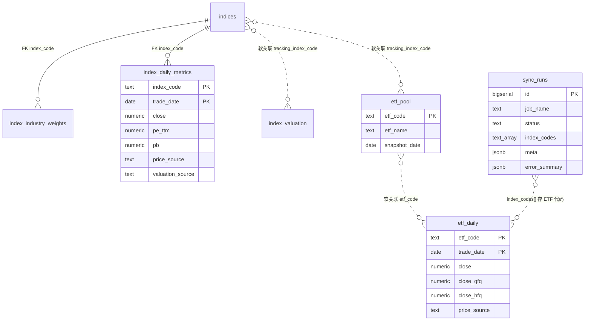

# Supabase 数据库表结构说明

本文档描述当前 Supabase PostgreSQL 实例中的表、视图及关系。

- **指数相关表 / 视图**：基线 DDL 见 `src/scheduled_tasks/models/schema.sql`。旧表 **`index_daily_prices` 已删除**（`migrations/20260718_drop_index_daily_prices.sql`）。红色火箭 job 可刷新 `index_valuation`（当日/5y/10y PE）、`index_daily_metrics`（PE/PB 日序列）与 `index_industry_weights`。
- **Live 相对本仓库 schema 的增量**（以 Studio / `information_schema` 为准；**本仓库尚未完全收录**）：
  - `indices` 增列：`valuation_status` / `valuation_status_reason` / `valuation_source` / `valuation_checked_at`（远程 migration 名 `index_valuation_status`）。
- **ETF 相关表**：定义见 `schema.sql`；`etf_daily` 价格由 `sync_etf_kline_yfinance` 主写，`etf_pool` 只读；红色火箭可对缺失日 INSERT（`price_source='hongsehuojian'`），不覆盖已有行情行。
- **汇率**：`fx_rates` **已下线**（job 已移除；`migrations/20260721_drop_fx_rates.sql`）。历史 run 可能仍出现 `sync_fx_rates_frankfurter`。
- **驾驶舱用户账本 12 表**：DDL + RLS 见 `migrations/20260710_cockpit_ledger_and_fx_rates.sql`（历史文件名保留；曾含 `fx_rates`）；**业务行由 `stock-charts` UI 写入**，本仓库不写账本数据。

RLS：

- 账本表：`authenticated` 仅能读写 `user_id = auth.uid()` 的行。
- 已授权共享只读（`authenticated` SELECT；job 经 `DATABASE_URL` 写入）：`etf_daily`、`etf_pool`、`indices`。
- 指数仪表盘公开读：`20260718_index_market_anon_read.sql` 为 `index_valuation`、`index_industry_weights`、`etf_daily`、`etf_pool`、`indices` 补 `anon` + `authenticated` SELECT policy（幂等）。
- `index_daily_metrics`：`20260721_add_index_daily_metrics.sql` 补 `anon`/`authenticated` SELECT（与 Live policy 同名）；`indices` 上仍保留历史 policy `Allow public read indices`（与 `indices_select_*` 并存，效果均为公开 SELECT）。
- `schema.sql` 本身不含完整 RLS；已有库请执行 `20260710_cockpit_ledger_and_fx_rates.sql`，并补跑 `20260718_etf_pool_authenticated_read.sql`、`20260718_index_market_anon_read.sql` 与 `20260721_add_index_daily_metrics.sql`。

> 已有库若仍为 `etf_grid_*` 旧名，请先执行：
> `psql "$DATABASE_URL" -f src/scheduled_tasks/models/migrations/20260709_etf_rename_and_adj_columns.sql`

## 概览

| 类型 | 名称                     | 说明                                                 | 本方案状态                        |
| ---- | ------------------------ | ---------------------------------------------------- | --------------------------------- |
| 表   | `indices`                | 指数元数据（Live 另有估值可用性状态列）              | 红色火箭可 ensure 单行            |
| 表   | `index_daily_metrics`    | 指数日指标（收盘点位 / PE TTM / PB）                 | **红色火箭主写**（schema 已收录） |
| 表   | `index_industry_weights` | 指数行业权重（申万分级）                             | **红色火箭主写**                  |
| 表   | `sync_runs`              | 同步任务执行记录（含 `meta`）                        | **写入**                          |
| 表   | `etf_pool`               | ETF 当前池（PK=`etf_code`，非历史快照）              | **只读**                          |
| 表   | `etf_daily`              | ETF 日行情（OHLC + volume + 前/后复权 + 来源）       | **主写**                          |
| 表   | `index_valuation`        | 跟踪指数估值快照（当日/5y/10y PE）                   | **红色火箭可写**                  |
| 表   | 账本 12 表               | 见 migration；UI 写入                                | **DDL only**                      |
| 视图 | `index_latest_snapshot`  | 指数最新快照（价列仍恒 null + `index_valuation` PE） | 可读                              |
| 视图 | `index_detail_snapshot`  | 指数各维度最新日期（`latest_price_date` 仍恒 null）  | 可读                              |

### 账本 12 表（DDL only）

`portfolio_settings`、`target_allocations`、`etf_instruments`、`positions`、`trade_records`、`cash_flows`、`cash_accounts`、`rebalance_plans`、`grid_plans`、`review_entries`、`decision_logs`、`portfolio`。

## 数据现状（live 快照）

> 统计日期：**2026-07-20**（只读查询 live Supabase）。行数会随 job 变化；以当日为准。

### 表行数总览

| 表                       | 行数       | 备注                                                                                        |
| ------------------------ | ---------- | ------------------------------------------------------------------------------------------- |
| `etf_pool`               | **18**     | 当前池断言 18 只；全部有 `tracking_index_code`                                              |
| `etf_daily`              | **42 670** | 覆盖池内 18 码；日期 **2011-09-20 → 2026-07-17**                                            |
| `indices`                | **18**     | 与池跟踪指数一一对应                                                                        |
| `index_valuation`        | **14**     | 估值日均为 **2026-07-17**；缺 4 个跨境/主题指数                                             |
| `index_industry_weights` | **1 003**  | **11** 个指数有权重；as_of 最新 **2026-04-30**                                              |
| `index_daily_metrics`    | **5 951**  | **仅** `000300.SH`；日期 **2002-01-04 → 2026-07-17**                                        |
| `sync_runs`              | **183**    | 含历史 `sync_indices` / `sync_etf_kline_baostock` / `sync_fx_rates_frankfurter` 等旧 job 名 |
| `portfolio_settings`     | **1**      | 账本里唯一有数据的表（`base_currency=CNY`）                                                 |
| 其余账本 11 表           | **0**      | `etf_instruments` / `positions` / `trade_records` 等为空                                    |

> `fx_rates` 已下线（Live 上 `to_regclass('public.fx_rates')` 应为 null）。

### `etf_daily.price_source` 分布

| price_source    | 行数   | 日期范围                |
| --------------- | ------ | ----------------------- |
| `yfinance`      | 37 616 | 2011-09-20 → 2026-07-17 |
| `hongsehuojian` | 5 042  | 2015-02-05 → 2026-07-17 |
| `adj_gap_fill`  | 12     | 仅 2025-10-24           |

池内 18 只 ETF 的 `close_qfq` / `close_hfq` **均无缺失**。最新交易日统一为 **2026-07-17**。

### 当前 `etf_pool`（18）

| etf_code | 名称                           | 分类 | tracking_index_code | aum_yi | snapshot_date |
| -------- | ------------------------------ | ---- | ------------------- | ------ | ------------- |
| 159307   | 博时中证红利低波 100ETF        | 策略 | 930955.CSI          | —      | 2026-07-18    |
| 159915   | 创业板 ETF                     | 宽基 | 399006.SZ           | 642    | 2026-05-22    |
| 159920   | 华夏恒生 ETF                   | 跨境 | HSI.HI              | 421    | 2026-07-16    |
| 159928   | 汇添富中证主要消费 ETF         | 行业 | 000932.SH           | 178    | 2026-07-16    |
| 159938   | 医药卫生 ETF                   | 行业 | 000991.SH           | 128    | 2026-05-22    |
| 159939   | 广发中证全指信息技术 ETF       | 行业 | 000993.SH           | —      | 2026-07-18    |
| 510300   | 沪深 300ETF                    | 宽基 | 000300.SH           | 3985   | 2026-05-22    |
| 510500   | 中证 500ETF                    | 宽基 | 000905.SH           | 512    | 2026-05-22    |
| 512170   | 华宝中证医疗 ETF               | 行业 | 399989.SZ           | 112    | 2026-07-17    |
| 512880   | 证券 ETF                       | 行业 | 399975.SZ           | 260    | 2026-05-22    |
| 512980   | 传媒 ETF                       | 行业 | 399971.SZ           | 68     | 2026-05-22    |
| 513050   | 易方达中证海外中国互联网 50ETF | 跨境 | H30533.CSI          | 205    | 2026-07-16    |
| 513100   | 国泰纳斯达克 100ETF            | 跨境 | NDX.NASDAQ          | 312    | 2026-07-16    |
| 513180   | 华夏恒生科技 ETF               | 跨境 | HSTECH.HI           | 150    | 2026-07-16    |
| 513500   | 博时标普 500ETF                | 跨境 | SPX.OTH             | 180    | 2026-07-16    |
| 515170   | 食品饮料 ETF                   | 行业 | 399396.SZ           | 120    | 2026-05-22    |
| 562500   | 华夏中证机器人 ETF             | 行业 | H30590.CSI          | 55     | 2026-07-16    |
| 588000   | 科创 50ETF                     | 宽基 | 000688.SH           | 918    | 2026-05-22    |

### 指数覆盖矩阵

| 指数 code                                                                                                              | `index_valuation` | `index_industry_weights` | `index_daily_metrics` |
| ---------------------------------------------------------------------------------------------------------------------- | ----------------- | ------------------------ | --------------------- |
| 000300.SH                                                                                                              | ✓                 | ✓                        | ✓（全库仅此码）       |
| 000688.SH / 000905.SH / 399006.SZ / 000991.SH / 000993.SH / 399396.SZ / 399971.SZ / 399975.SZ / 399989.SZ / 930955.CSI | ✓                 | ✓                        | —                     |
| 000932.SH                                                                                                              | ✓                 | —                        | —                     |
| HSI.HI / HSTECH.HI                                                                                                     | ✓                 | —                        | —                     |
| H30533.CSI / H30590.CSI / NDX.NASDAQ / SPX.OTH                                                                         | —                 | —                        | —                     |

- `indices.valuation_status`：当前 **18 行均为 `unknown`**（`valuation_source` / `valuation_checked_at` 为空）。
- `index_daily_metrics` 来源：`price_source='hongsehuojian'`；其中 2 428 行同时有 `valuation_source='hongsehuojian'`（PE/PB 自 **2016-07-18** 起），其余 3 523 行仅有收盘点位。
- 视图 `index_latest_snapshot` / `index_detail_snapshot` **尚未改挂** `index_daily_metrics`：收盘相关列 / `latest_price_date` 仍恒为 `null`，估值仍来自 `index_valuation`。

### 近期 `sync_runs`（按 job，含历史名）

| job_name                           | success  | failed / partial     | 最近成功（UTC） |
| ---------------------------------- | -------- | -------------------- | --------------- |
| `sync_hongsehuojian_fill_validate` | 40       | 3 failed             | 2026-07-19      |
| `sync_etf_kline_yfinance`          | 4        | 7 failed             | 2026-07-19      |
| `sync_official_cross_check`        | 6        | 3 failed + 6 partial | 2026-07-17      |
| `sync_fx_rates_frankfurter` 等旧名 | 有历史行 | —                    | 已停用，仅留痕  |
| `sync_etf_kline_baostock` 等旧名   | 有历史行 | —                    | 已停用，仅留痕  |

## 实体关系

> **外键 vs 软关联**：真 FK 仅 `index_industry_weights.index_code` → `indices.code`、`index_daily_metrics.index_code` → `indices.code`（均为 `ON DELETE CASCADE`）。
> `etf_pool.tracking_index_code`、`index_valuation.tracking_index_code`、`etf_daily.etf_code` ↔ `etf_pool.etf_code`、`sync_runs.index_codes[]` 均为按代码的逻辑关联，**库中无 FK**。



---

## 指数表

旧全市场 TuShare `sync_indices` 链路已删除。**`index_daily_prices` 已删除**（`20260718_drop_index_daily_prices.sql`）。**`index_daily_metrics`** 已收录于 `schema.sql` / `20260721_add_index_daily_metrics.sql`（与已删的日线表职责不同：合入 close + PE/PB，且目前仅沪深 300 有数据）。红色火箭 job `sync_hongsehuojian_fill_validate`（见 [hongsehuojian-fill-validate.md](./hongsehuojian-fill-validate.md)）可 ensure `indices`、upsert `index_valuation` / `index_daily_metrics`，并以红色火箭主源刷新 `index_industry_weights`。`index_daily_valuations` 已删除；指数视图估值仍挂 `index_valuation`（视图收盘相关列仍恒为 null，**未**改挂 `index_daily_metrics`）。

### `indices` — 指数元数据

| 列名                      | 类型          | 约束                                                                             | 说明                                                      |
| ------------------------- | ------------- | -------------------------------------------------------------------------------- | --------------------------------------------------------- |
| `code`                    | `text`        | **PK**；`^[A-Z0-9]{2,12}\.(SH\|SZ\|CSI\|HI\|NASDAQ\|OTH)$`                       | 指数代码（含交易所后缀；含跨境）                          |
| `name`                    | `text`        | NOT NULL                                                                         | 名称                                                      |
| `category`                | `text`        | NOT NULL；非空白                                                                 | 分类                                                      |
| `display_order`           | `integer`     | NOT NULL                                                                         | 展示排序                                                  |
| `created_at`              | `timestamptz` | NOT NULL, DEFAULT `now()`                                                        | 创建时间                                                  |
| `updated_at`              | `timestamptz` | NOT NULL, DEFAULT `now()`                                                        | 更新时间                                                  |
| `valuation_status`        | `text`        | NOT NULL, DEFAULT `'unknown'`；CHECK ∈ `reliable` / `unknown` / `not_applicable` | 估值可用性状态（**Live 列**；本仓库 `schema.sql` 未收录） |
| `valuation_status_reason` | `text`        | 可空                                                                             | 状态原因；注释约定：禁止把数据源失败自动解释为不适用      |
| `valuation_source`        | `text`        | 可空                                                                             | 实际指数级估值来源；禁止成分股聚合或代理指数              |
| `valuation_checked_at`    | `timestamptz` | 可空                                                                             | 最近一次估值可用性检查时间                                |

### `index_daily_metrics` — 指数日指标

> DDL 见 `schema.sql` 与 `migrations/20260721_add_index_daily_metrics.sql`。表注释：指数日指标（收盘点位、PE TTM、PB）。与已删除的 `index_daily_prices` 不同：同一主键下可同时存点位与估值字段。主写：`sync_hongsehuojian_fill_validate`。

| 列名               | 类型          | 约束                                | 说明                                              |
| ------------------ | ------------- | ----------------------------------- | ------------------------------------------------- |
| `index_code`       | `text`        | **PK**；FK → `indices.code` CASCADE | 指数代码                                          |
| `trade_date`       | `date`        | **PK**                              | 交易日                                            |
| `close`            | `numeric`     | 可空；CHECK `> 0` 或 null           | 收盘点位                                          |
| `pe_ttm`           | `numeric`     | 可空；CHECK `> 0` 或 null           | 市盈率 TTM                                        |
| `pb`               | `numeric`     | 可空；CHECK `> 0` 或 null           | 市净率                                            |
| `price_source`     | `text`        | 可空                                | 收盘点位最终采用来源（live 多为 `hongsehuojian`） |
| `valuation_source` | `text`        | 可空                                | PE/PB 最终采用来源                                |
| `updated_at`       | `timestamptz` | NOT NULL, DEFAULT `now()`           | 更新时间                                          |

**额外 CHECK：** `num_nonnulls(close, pe_ttm, pb) > 0`（至少有一个指标非空）。

**索引：** `idx_index_daily_metrics_trade_date`：`(trade_date DESC)`

**RLS：** `index_daily_metrics_select_anon` / `index_daily_metrics_select_authenticated`（`USING (true)`；由 `20260721_add_index_daily_metrics.sql` 幂等补齐）。

### `index_industry_weights` — 指数行业权重

| 列名            | 类型            | 约束                                | 说明                   |
| --------------- | --------------- | ----------------------------------- | ---------------------- |
| `index_code`    | `text`          | **PK**；FK → `indices.code` CASCADE | 指数代码               |
| `as_of_date`    | `date`          | **PK**                              | 权重生效日             |
| `sw_level`      | `text`          | **PK**；CHECK ∈ `sw1`/`sw2`/`sw3`   | 申万一级 / 二级 / 三级 |
| `industry_name` | `text`          | **PK**                              | 行业名称               |
| `weight_pct`    | `numeric(10,4)` | NOT NULL；CHECK `(0, 100]`          | 权重占比（%）          |
| `created_at`    | `timestamptz`   | NOT NULL, DEFAULT `now()`           | 创建时间               |
| `updated_at`    | `timestamptz`   | NOT NULL, DEFAULT `now()`           | 更新时间               |

**索引：** `idx_index_industry_weights_as_of_date`：`(as_of_date DESC)`

写入：红色火箭按指数 **删旧写新**（最新一期 sw1/sw2/sw3）。

### 视图 `index_latest_snapshot`

按 `indices.display_order` 输出估值快照。**当前定义仍未读取 `index_daily_metrics`**，故收盘相关列恒为 null。

| 列名                                                               | 来源                             | 说明                       |
| ------------------------------------------------------------------ | -------------------------------- | -------------------------- |
| `code` / `name` / `category` / `display_order`                     | `indices`                        | 元数据                     |
| `as_of_date` / `close` / `history_high` / `drawdown_from_high_pct` | 常量 `null`                      | 视图未改挂日指标表         |
| `pe_ttm`                                                           | `index_valuation.current_pe_ttm` | 当日 PE                    |
| `pe_ttm_avg_5y` / `pe_ttm_avg_10y`                                 | 同快照表                         | 近 5y / 10y PE 均值        |
| `valuation_as_of_date`                                             | `index_valuation.trade_date`     | 估值日期                   |
| `pe_percentile_*` / `pb*`                                          | 常量 `null`                      | 已无日估值表，分位不再计算 |

### 视图 `index_detail_snapshot`

| 列名                                           | 说明                                            |
| ---------------------------------------------- | ----------------------------------------------- |
| `code` / `name` / `category` / `display_order` | 元数据                                          |
| `latest_price_date`                            | 恒为 `null`（视图未改挂 `index_daily_metrics`） |
| `latest_valuation_date`                        | `index_valuation.trade_date`                    |
| `latest_industry_date`                         | `max(index_industry_weights.as_of_date)`        |

---

### `sync_runs` — 同步任务执行记录

| 列名            | 类型          | 约束                      | 说明                                                                      |
| --------------- | ------------- | ------------------------- | ------------------------------------------------------------------------- |
| `id`            | `bigserial`   | **PK**                    | 自增主键                                                                  |
| `job_name`      | `text`        | NOT NULL                  | 如 `sync_etf_kline_yfinance`；历史 run 可能仍为 `sync_etf_kline_baostock` |
| `status`        | `text`        | NOT NULL                  | `running` / `success` / `partial` / `failed`                              |
| `started_at`    | `timestamptz` | NOT NULL, DEFAULT `now()` | 开始时间                                                                  |
| `finished_at`   | `timestamptz` | 可空                      | 结束时间                                                                  |
| `index_codes`   | `text[]`      | NOT NULL, DEFAULT `'{}'`  | **历史命名遗留**：本 run 标的代码（ETF 为 6 位）                          |
| `success_codes` | `text[]`      | NOT NULL, DEFAULT `'{}'`  | 成功代码                                                                  |
| `failure_count` | `integer`     | NOT NULL, DEFAULT `0`     | 失败数量                                                                  |
| `success_count` | `integer`     | NOT NULL, DEFAULT `0`     | 成功数量                                                                  |
| `error_summary` | `jsonb`       | NOT NULL, DEFAULT `'[]'`  | 失败详情                                                                  |
| `meta`          | `jsonb`       | NOT NULL, DEFAULT `'{}'`  | 结构化运行上下文（mode、pool_size、adj 结果等）                           |
| `created_at`    | `timestamptz` | NOT NULL, DEFAULT `now()` | 创建时间                                                                  |

---

## ETF 表结构详情

### `etf_pool` — ETF 当前池主数据

> 原名 `etf_pool_snapshots`（2026-07-15 更名）。主键仅为 `etf_code` → **当前池**（每标的一行），**不是**按日多版本历史快照。读池必须 **全表直读**，禁止 `where snapshot_date = max(...)`。列名 `snapshot_date` 表示「元数据最近刷新日」，非快照版本键。
>
> `tracking_index_code` 回填见 `migrations/20260716_backfill_etf_pool_tracking_index.sql`（job 仍只读本表；元数据补齐用迁移/SQL）。池组成调整见 `migrations/20260717_etf_pool_replace_medical_drop_metals_nev.sql`、`migrations/20260718_drop_sse50_etf_510050.sql`、`migrations/20260718_drop_pv_etf_515790.sql` 与 `migrations/20260718_etf_pool_swap_bank_semi_ai_for_it_div.sql`（出池银行/半导体/AI，入池全指信息 `159939` + 红利低波 100 `159307`；当前池断言 **18** 只）。出池标的关联行情清理见 `migrations/20260717_purge_removed_etf_related_data.sql`。不在池内的残留指数清理见 `migrations/20260718_purge_orphan_indices.sql`。**增删 ETF 须同步增删其独占跟踪指数**（见 `.cursor/rules/etf-pool-index-lifecycle.mdc`）。跨境指数（`*.HI` / `H*.CSI` / `NASDAQ` / `OTH`）可进 `etf_pool` 与 `indices`（live 约束已放宽）。

| 列名                    | 类型          | 约束                         | 说明                                   |
| ----------------------- | ------------- | ---------------------------- | -------------------------------------- |
| `etf_code`              | `text`        | **PK**                       | 6 位数字，无交易所后缀                 |
| `etf_name`              | `text`        | NOT NULL                     | 名称                                   |
| `category`              | `text`        | NOT NULL                     | 分类                                   |
| `direction`             | `text`        | 可空                         | 方向标签                               |
| `source`                | `text`        | NOT NULL, DEFAULT `'预计算'` | 数据来源                               |
| `tracking_index_code`   | `text`        | 可空                         | 跟踪指数代码                           |
| `tracking_index_name`   | `text`        | 可空                         | 跟踪指数名称                           |
| `aum_yi`                | `numeric`     | 可空                         | 规模（亿元）                           |
| `avg_daily_turnover_yi` | `numeric`     | 可空                         | 日均成交额（亿元）                     |
| `premium_discount`      | `numeric`     | 可空                         | 折溢价                                 |
| `expense_ratio`         | `numeric`     | 可空                         | 管理费率                               |
| `snapshot_date`         | `date`        | NOT NULL                     | 该标的池信息最近刷新日（可跨行不一致） |
| `updated_at`            | `timestamptz` | NOT NULL, DEFAULT `now()`    | 更新时间                               |

**索引：** `etf_pool_snapshot_date_idx`：`(snapshot_date DESC)`

---

### `etf_daily` — ETF 日行情

| 列名                                                                              | 类型                | 约束                      | 说明                                                                                                                                                                                                           |
| --------------------------------------------------------------------------------- | ------------------- | ------------------------- | -------------------------------------------------------------------------------------------------------------------------------------------------------------------------------------------------------------- |
| `etf_code`                                                                        | `text`              | **PK**                    | ETF 代码                                                                                                                                                                                                       |
| `trade_date`                                                                      | `date`              | **PK**                    | 交易日                                                                                                                                                                                                         |
| `open/high/low/close`                                                             | `numeric`           | close NOT NULL            | **不复权** OHLC                                                                                                                                                                                                |
| `volume`                                                                          | `numeric`           | 可空                      | 成交量（**手**）                                                                                                                                                                                               |
| `open_qfq` / `high_qfq` / `low_qfq` / `close_qfq`                                 | `numeric(18,4)`     | 可空                      | 前复权 OHLC                                                                                                                                                                                                    |
| `open_hfq` / `high_hfq` / `low_hfq` / `close_hfq`                                 | `numeric(18,4)`     | 可空                      | 后复权 OHLC                                                                                                                                                                                                    |
| `price_source`                                                                    | `text`              | 可空                      | 不复权 OHLC/volume 来源：`yfinance`（主写）/ `hongsehuojian`（红色火箭补缺 INSERT）/ `sse`（上交所官网纠偏）/ `adj_gap_fill`（历史缺复权回填）；`sse`/`szse` 时主写 UPSERT 不覆盖该行 OHLC；`adj_check` 仍可刷复权列、不改本列 |
| `updated_at`                                                                      | `timestamptz`       | NOT NULL, DEFAULT `now()` | **价格侧**新鲜度                                                                                                                                                                                               |

> 已删除闲置列（job 从不写）：`nav` / `premium_rate` / `fund_size` / `listing_days` / `bid_price` / `ask_price`（`20260722_drop_etf_daily_idle_columns.sql`）。成交额列删除见 `20260717_drop_etf_daily_amount_columns.sql`。

**索引：** `etf_daily_trade_date_idx`：`(trade_date DESC)`

---

### `fx_rates` — 已下线

日频汇率表与 `sync_fx_rates_frankfurter` job **已移除**。DDL 曾见于 `20260710_cockpit_ledger_and_fx_rates.sql`；删除见 `20260721_drop_fx_rates.sql`。驾驶舱跨币种折算需另起数据源。`sync_runs` 中可能仍有历史 `sync_fx_rates_frankfurter` 行。

---

### `index_valuation` — 跟踪指数估值

按跟踪指数各一行；红色火箭 job 可 **upsert** 刷新（当日 PE + 5y/10y 均值）。不存日估值序列。

| 列名                  | 类型          | 约束                      | 说明             |
| --------------------- | ------------- | ------------------------- | ---------------- |
| `tracking_index_code` | `text`        | **PK**                    | 跟踪指数代码     |
| `trade_date`          | `date`        | NOT NULL                  | 估值数据日期     |
| `current_pe_ttm`      | `numeric`     | 可空                      | 当前 PE（TTM）   |
| `pe_ttm_avg_5y`       | `numeric`     | 可空                      | 近 5 年 PE 均值  |
| `pe_ttm_avg_10y`      | `numeric`     | 可空                      | 近 10 年 PE 均值 |
| `updated_at`          | `timestamptz` | NOT NULL, DEFAULT `now()` | 更新时间         |

---

## 数据流

### ETF 日 K（本仓库）

```
etf_pool（只读，全表）
    │
    ▼
yfinance（Yahoo；海外 runner 可用）
    │
    ├─ full / incremental → etf_daily（三种价 + price_source=yfinance；跳过已 sse/szse 行）
    ├─ adj_check          → etf_daily（仅 UPDATE *_qfq/*_hfq；含官网纠偏行，不改 OHLC/price_source）
    └─ sync_runs + artifacts/sync_etf_kline_summary.json → Bark

红色火箭（见 hongsehuojian-fill-validate.md）
    ├─ INSERT-only → etf_daily（price_source=hongsehuojian；不覆盖已有行）
    ├─ INSERT-only → indices（ensure）
    ├─ upsert → index_valuation（当日 PE + 5y/10y 均值）
    ├─ coalesce upsert → index_daily_metrics（PE/PB；可选 close）
    └─ replace → index_industry_weights（按指数删旧写新）

官网校验（见 official-cross-check.md；默认只读比对）
    ├─ 上交所 yunhq → vs etf_daily OHLC（`--from-pool` 覆盖池内全部 5xxxxx）
    └─ 中证 index-perf → vs index_valuation.current_pe_ttm
       （单标的模式；`--from-pool` 默认跳过指数）
       （--apply-official --yes 才 UPDATE mismatch → price_source=sse，此后主写锁定）
```

同步入口：

- 价格：`python -m scheduled_tasks.jobs.sync_etf_kline_yfinance`（workflow：`同步 ETF 日 K 到 Supabase`）
- 红色火箭 / 指数估值：`python -m scheduled_tasks.jobs.sync_hongsehuojian_fill_validate`（workflow：`同步指数估值到 Supabase`；写 `index_valuation` + `index_daily_metrics`）
- 官网校验：`python -m scheduled_tasks.jobs.sync_official_cross_check`（见 [official-cross-check.md](./official-cross-check.md)）

---

## 初始化与维护

```bash
# 新库（表 DDL + 当前指数视图；不含账本 12 表、不含 RLS）
psql "$DATABASE_URL" -f src/scheduled_tasks/models/schema.sql

# 驾驶舱账本 12 表 + 共享表 RLS（新库与已有库均需；历史文件名曾含 fx_rates）
psql "$DATABASE_URL" -f src/scheduled_tasks/models/migrations/20260710_cockpit_ledger_and_fx_rates.sql
# 补 etf_pool authenticated 只读（幂等；新库 schema 建 etf_pool 时旧版 20260710 可能漏配）
psql "$DATABASE_URL" -f src/scheduled_tasks/models/migrations/20260718_etf_pool_authenticated_read.sql
# 指数日指标表 + 公开读 RLS（新库若已跑最新 schema.sql 仍建议执行以补 RLS）
psql "$DATABASE_URL" -f src/scheduled_tasks/models/migrations/20260721_add_index_daily_metrics.sql
# 下线汇率表（幂等；Live 若已 drop 则为 no-op）
psql "$DATABASE_URL" -f src/scheduled_tasks/models/migrations/20260721_drop_fx_rates.sql

# —— 以下为已有库升级（新库若已跑最新 schema.sql，多数可跳过；以各文件头注释为准）——

# rename + 复权列等（幂等）
psql "$DATABASE_URL" -f src/scheduled_tasks/models/migrations/20260709_etf_rename_and_adj_columns.sql

# etf_pool_snapshots → etf_pool
psql "$DATABASE_URL" -f src/scheduled_tasks/models/migrations/20260715_rename_etf_pool_snapshots_to_etf_pool.sql

# 清理废弃对象（旧库）：成交额列 + 闲置净值侧列 + trade_calendar
psql "$DATABASE_URL" -f src/scheduled_tasks/models/migrations/20260717_drop_etf_daily_amount_columns.sql
psql "$DATABASE_URL" -f src/scheduled_tasks/models/migrations/20260722_drop_etf_daily_idle_columns.sql
psql "$DATABASE_URL" -f src/scheduled_tasks/models/migrations/20260717_drop_trade_calendar.sql

# etf_pool.tracking_index_code 回填
psql "$DATABASE_URL" -f src/scheduled_tasks/models/migrations/20260716_backfill_etf_pool_tracking_index.sql

# 表/列中文注释（幂等；Dashboard 列 Description 可见）
psql "$DATABASE_URL" -f src/scheduled_tasks/models/migrations/20260716_add_chinese_comments.sql

# 池组成调整（医疗 159828→512170 等）
psql "$DATABASE_URL" -f src/scheduled_tasks/models/migrations/20260717_etf_pool_replace_medical_drop_metals_nev.sql

# 出池标的关联行情清理
psql "$DATABASE_URL" -f src/scheduled_tasks/models/migrations/20260717_purge_removed_etf_related_data.sql

# 出池上证50 ETF 510050 + 清理独占指数 000016.SH
psql "$DATABASE_URL" -f src/scheduled_tasks/models/migrations/20260718_drop_sse50_etf_510050.sql

# 出池光伏 ETF 515790 + 清理独占指数 931151.CSI
psql "$DATABASE_URL" -f src/scheduled_tasks/models/migrations/20260718_drop_pv_etf_515790.sql

# 出池银行/半导体/AI，入池全指信息 + 红利低波100（断言 18 只）
psql "$DATABASE_URL" -f src/scheduled_tasks/models/migrations/20260718_etf_pool_swap_bank_semi_ai_for_it_div.sql

# 清理不在当前池的残留 indices（+ index_valuation；行业权重 CASCADE）
psql "$DATABASE_URL" -f src/scheduled_tasks/models/migrations/20260718_purge_orphan_indices.sql

# 回填 2025-10-24 ETF 缺复权列
psql "$DATABASE_URL" -f src/scheduled_tasks/models/migrations/20260718_backfill_etf_daily_adj_20251024.sql

# 删除指数日线表
psql "$DATABASE_URL" -f src/scheduled_tasks/models/migrations/20260718_drop_index_daily_prices.sql

# 删除 index_daily_valuations；重建指数视图挂估值表
# （新库若已跑最新 schema.sql 则无需；旧库必跑；须在 rename_drop_snapshots 之前）
psql "$DATABASE_URL" -f src/scheduled_tasks/models/migrations/20260717_drop_index_daily_valuations.sql

# 历史步骤：去掉 `_snapshots` 后缀，etf_valuation_snapshots→etf_valuation
# （新库若已跑最新 schema.sql + 最新 cockpit migration 则无需；旧库必跑）
psql "$DATABASE_URL" -f src/scheduled_tasks/models/migrations/20260717_rename_drop_snapshots_suffix.sql

# 名实相符：etf_valuation→index_valuation（保留数据、RLS、GRANT 与视图依赖）
psql "$DATABASE_URL" -f src/scheduled_tasks/models/migrations/20260719_rename_etf_valuation_to_index_valuation.sql

# 收录 index_daily_metrics（若上面初始化段已跑可跳过）
psql "$DATABASE_URL" -f src/scheduled_tasks/models/migrations/20260721_add_index_daily_metrics.sql

# 下线 fx_rates（若上面初始化段已跑可跳过）
psql "$DATABASE_URL" -f src/scheduled_tasks/models/migrations/20260721_drop_fx_rates.sql
```

`CREATE TABLE IF NOT EXISTS` **不会**给已存在表加列或改名；已有库必须以 migrations 为准。

列名保持英文；中文说明通过 PostgreSQL `COMMENT ON` 挂在表/列上（见 `20260716_add_chinese_comments.sql`），覆盖共享行情表、账本 12 表及指数视图。

---

## 常用查询

```sql
select id, job_name, status, started_at, finished_at, success_count, failure_count, meta
from sync_runs
where job_name in (
  'sync_etf_kline_yfinance',
  'sync_etf_kline_baostock',  -- 重命名前的历史 run
  'sync_fx_rates_frankfurter',  -- 已下线，仅历史留痕
  'sync_hongsehuojian_fill_validate'
)
order by started_at desc
limit 20;
```

```sql
select etf_code, etf_name, category, tracking_index_code, aum_yi, snapshot_date
from etf_pool
order by etf_code;
```

```sql
select etf_code, trade_date, close, close_qfq, close_hfq, volume, price_source
from etf_daily
where etf_code = '510300'
order by trade_date desc
limit 30;
```

```sql
-- fx_rates 已下线；确认表不存在
select to_regclass('public.fx_rates');  -- 期望 null
```

```sql
-- 指数最新价 + 估值快照（视图；收盘列仍为 null）
select code, name, as_of_date, close, pe_ttm, pe_ttm_avg_5y, pe_ttm_avg_10y,
       valuation_as_of_date
from index_latest_snapshot
order by display_order;

select tracking_index_code, trade_date, current_pe_ttm, pe_ttm_avg_5y, pe_ttm_avg_10y
from index_valuation
order by tracking_index_code;

select index_code, as_of_date, sw_level, industry_name, weight_pct
from index_industry_weights
where index_code = '399989.SZ'
order by sw_level, weight_pct desc;

-- 指数日指标（目前主要是沪深300；由红色火箭写入）
select index_code, trade_date, close, pe_ttm, pb, price_source, valuation_source
from index_daily_metrics
where index_code = '000300.SH'
order by trade_date desc
limit 30;

-- 池 vs 跟踪指数覆盖缺口
select i.code,
       exists (select 1 from index_valuation v where v.tracking_index_code = i.code) as has_valuation,
       exists (select 1 from index_industry_weights w where w.index_code = i.code) as has_industry,
       exists (select 1 from index_daily_metrics m where m.index_code = i.code) as has_daily_metrics
from indices i
order by i.code;
```

---

## 相关文档

- [Supabase 验证指南](./supabase-verification.md)
- [红色火箭补缺 / 校验](./hongsehuojian-fill-validate.md)
- [未来 stock-view 集成说明](./future-stock-view-integration.md)
