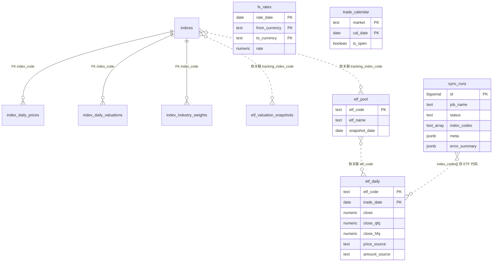

# Supabase 数据库表结构说明

本文档描述当前 Supabase PostgreSQL 实例中的表、视图及关系。

- **指数相关表 / 视图**：定义见 `src/scheduled_tasks/models/schema.sql`，**暂不维护**（历史数据保留，本仓库不再写入）。
- **ETF 相关表**：定义见 `schema.sql`；`etf_daily` 价格由 `sync_etf_kline_yfinance` 主写；`etf_pool` 只读；`etf_valuation_snapshots` 非本 job 写入；成交额由国内 `sync_etf_enrich_akshare` 补数。
- **汇率**：`fx_rates` 由 `sync_fx_rates_frankfurter` 主写（Frankfurter / ECB）。
- **驾驶舱用户账本 12 表**：DDL + RLS 见 `migrations/20260710_cockpit_ledger_and_fx_rates.sql`；**业务行由 `stock-charts` UI 写入**，本仓库不写账本数据。

RLS：

- 账本表：`authenticated` 仅能读写 `user_id = auth.uid()` 的行。
- 共享表（`fx_rates`、`etf_daily`、`etf_pool`、`trade_calendar`、`indices`、`index_daily_prices`）：`authenticated` 只读；job 经 `DATABASE_URL` 写入。
- `schema.sql` 本身不含完整 RLS；已有库请执行 `20260710_cockpit_ledger_and_fx_rates.sql`。

> 已有库若仍为 `etf_grid_*` 旧名，请先执行：
> `psql "$DATABASE_URL" -f src/scheduled_tasks/models/migrations/20260709_etf_rename_and_adj_columns.sql`

## 概览

| 类型 | 名称                      | 说明                                    | 本方案状态       |
| ---- | ------------------------- | --------------------------------------- | ---------------- |
| 表   | `indices`                 | 指数元数据                              | **暂不维护**     |
| 表   | `index_daily_prices`      | 指数日收盘价                            | **暂不维护**     |
| 表   | `index_daily_valuations`  | 指数日估值（PE/PB）                     | **暂不维护**     |
| 表   | `index_industry_weights`  | 指数行业权重（申万分级）                | **暂不维护**     |
| 表   | `sync_runs`               | 同步任务执行记录（含 `meta`）           | **写入**         |
| 表   | `etf_pool`                | ETF 当前池（PK=`etf_code`，非历史快照） | **只读**         |
| 表   | `etf_daily`               | ETF 日行情（OHLCV + 前/后复权 + 来源）  | **主写**         |
| 表   | `etf_valuation_snapshots` | 跟踪指数估值快照                        | **不写**         |
| 表   | `fx_rates`                | 日频汇率（USD/CNY/HKD 三角）            | **主写**         |
| 表   | `trade_calendar`          | 市场级交易日历（`market='CN'`）         | **主写**（国内） |
| 表   | 账本 12 表                | 见 migration；UI 写入                   | **DDL only**     |
| 视图 | `index_latest_snapshot`   | 指数最新快照                            | **暂不维护**     |
| 视图 | `index_detail_snapshot`   | 指数各维度最新日期                      | **暂不维护**     |

### 账本 12 表（DDL only）

`portfolio_settings`、`target_allocations`、`etf_instruments`、`positions`、`trade_records`、`cash_flows`、`cash_accounts`、`rebalance_plans`、`grid_plans`、`review_entries`、`decision_logs`、`portfolio_snapshots`。

领域字段 `FxRate.date` 映射物理列 `fx_rates.rate_date`。

## 实体关系

> **外键 vs 软关联**：仅 `index_daily_*` / `index_industry_weights` → `indices.code` 为真 FK。
> `etf_pool.tracking_index_code`、`etf_valuation_snapshots.tracking_index_code`、`etf_daily.etf_code` ↔ `etf_pool.etf_code`、`sync_runs.index_codes[]` 均为按代码的逻辑关联，**库中无 FK**。



---

## 指数表（暂不维护）

`indices` / `index_daily_prices` / `index_daily_valuations` / `index_industry_weights` 及视图 `index_latest_snapshot` / `index_detail_snapshot` 仍保留在 schema 中，但 **本仓库已删除 `sync_indices` / TuShare 链路**，不再自动刷新。

---

### `sync_runs` — 同步任务执行记录

| 列名            | 类型          | 约束                      | 说明                                                                      |
| --------------- | ------------- | ------------------------- | ------------------------------------------------------------------------- |
| `id`            | `bigserial`   | **PK**                    | 自增主键                                                                  |
| `job_name`      | `text`        | NOT NULL                  | 如 `sync_etf_kline_yfinance`；历史 run 可能仍为 `sync_etf_kline_baostock` |
| `status`        | `text`        | NOT NULL                  | `running` / `success` / `partial` / `failed`                              |
| `started_at`    | `timestamptz` | NOT NULL, DEFAULT `now()` | 开始时间                                                                  |
| `finished_at`   | `timestamptz` | 可空                      | 结束时间                                                                  |
| `index_codes`   | `text[]`      | NOT NULL, DEFAULT `'{}'`  | **历史命名遗留**：本 run 标的代码（ETF 为 6 位）                          |
| `success_codes` | `text[]`      | NOT NULL, DEFAULT `'{}'`  | 成功代码                                                                  |
| `failure_count` | `integer`     | NOT NULL, DEFAULT `0`     | 失败数量                                                                  |
| `success_count` | `integer`     | NOT NULL, DEFAULT `0`     | 成功数量                                                                  |
| `error_summary` | `jsonb`       | NOT NULL, DEFAULT `'[]'`  | 失败详情                                                                  |
| `meta`          | `jsonb`       | NOT NULL, DEFAULT `'{}'`  | 结构化运行上下文（mode、pool_size、adj 结果等）                           |
| `created_at`    | `timestamptz` | NOT NULL, DEFAULT `now()` | 创建时间                                                                  |

---

## ETF 表结构详情

### `etf_pool` — ETF 当前池主数据

> 原名 `etf_pool_snapshots`（2026-07-15 更名）。主键仅为 `etf_code` → **当前池**（每标的一行），**不是**按日多版本历史快照。读池必须 **全表直读**，禁止 `where snapshot_date = max(...)`。列名 `snapshot_date` 表示「元数据最近刷新日」，非快照版本键。
>
> `tracking_index_code` 回填见 `migrations/20260716_backfill_etf_pool_tracking_index.sql`（job 仍只读本表；元数据补齐用迁移/SQL）。H 开头 CSI 与海外指数可写 `etf_pool`，但受 `indices.code` 格式约束，不能进 `indices` 白名单。

| 列名                    | 类型          | 约束                         | 说明                                   |
| ----------------------- | ------------- | ---------------------------- | -------------------------------------- |
| `etf_code`              | `text`        | **PK**                       | 6 位数字，无交易所后缀                 |
| `etf_name`              | `text`        | NOT NULL                     | 名称                                   |
| `category`              | `text`        | NOT NULL                     | 分类                                   |
| `direction`             | `text`        | 可空                         | 方向标签                               |
| `source`                | `text`        | NOT NULL, DEFAULT `'预计算'` | 数据来源                               |
| `tracking_index_code`   | `text`        | 可空                         | 跟踪指数代码                           |
| `tracking_index_name`   | `text`        | 可空                         | 跟踪指数名称                           |
| `aum_yi`                | `numeric`     | 可空                         | 规模（亿元）                           |
| `avg_daily_turnover_yi` | `numeric`     | 可空                         | 日均成交额（亿元）                     |
| `premium_discount`      | `numeric`     | 可空                         | 折溢价                                 |
| `expense_ratio`         | `numeric`     | 可空                         | 管理费率                               |
| `snapshot_date`         | `date`        | NOT NULL                     | 该标的池信息最近刷新日（可跨行不一致） |
| `updated_at`            | `timestamptz` | NOT NULL, DEFAULT `now()`    | 更新时间                               |

**索引：** `etf_pool_snapshot_date_idx`：`(snapshot_date DESC)`

---

### `etf_daily` — ETF 日行情

| 列名                                                                              | 类型                | 约束                      | 说明                                                                     |
| --------------------------------------------------------------------------------- | ------------------- | ------------------------- | ------------------------------------------------------------------------ |
| `etf_code`                                                                        | `text`              | **PK**                    | ETF 代码                                                                 |
| `trade_date`                                                                      | `date`              | **PK**                    | 交易日                                                                   |
| `open/high/low/close`                                                             | `numeric`           | close NOT NULL            | **不复权** OHLC                                                          |
| `volume`                                                                          | `numeric`           | 可空                      | 成交量（**手**）                                                         |
| `amount`                                                                          | `numeric`           | 可空                      | 成交额（元）；主源 AKShare，东财熔断后窗口可回退 BaoStock（UPDATE-only） |
| `nav` / `premium_rate` / `fund_size` / `listing_days` / `bid_price` / `ask_price` | `numeric`/`integer` | 可空                      | **非本 job 字段**，upsert 不覆盖                                         |
| `open_qfq` / `high_qfq` / `low_qfq` / `close_qfq`                                 | `numeric(18,4)`     | 可空                      | 前复权 OHLC                                                              |
| `open_hfq` / `high_hfq` / `low_hfq` / `close_hfq`                                 | `numeric(18,4)`     | 可空                      | 后复权 OHLC                                                              |
| `price_source`                                                                    | `text`              | 可空                      | 仅表示不复权 OHLCV 来源；本 job 写 `'yfinance'`；`adj_check` 不更新      |
| `amount_source`                                                                   | `text`              | 可空                      | 成交额来源（`akshare` / `baostock`）；与 `price_source` 独立             |
| `amount_updated_at`                                                               | `timestamptz`       | 可空                      | 成交额最近补数时间；**不等于**价格新鲜度                                 |
| `updated_at`                                                                      | `timestamptz`       | NOT NULL, DEFAULT `now()` | **价格侧**新鲜度；enrichment **禁止**刷新本列                            |

**索引：** `etf_daily_trade_date_idx`：`(trade_date DESC)`

> 语义：`updated_at` ≠ 价格以外字段的新鲜度。成交额看 `amount_updated_at` / `amount_source`。

---

### `fx_rates` — 日频汇率

由 `sync_fx_rates_frankfurter` 主写（Frankfurter / ECB）。三角货币：`CNY` / `HKD` / `USD`（`from ≠ to`）。

| 列名            | 类型            | 约束                              | 说明                                    |
| --------------- | --------------- | --------------------------------- | --------------------------------------- |
| `rate_date`     | `date`          | **PK**                            | 汇率日期（领域 `FxRate.date` 映射本列） |
| `from_currency` | `text`          | **PK**；CHECK ∈ CNY/HKD/USD       | 源币种                                  |
| `to_currency`   | `text`          | **PK**；CHECK ∈ CNY/HKD/USD       | 目标币种                                |
| `rate`          | `numeric(18,8)` | NOT NULL；CHECK `> 0`             | 汇率（1 from = rate to）                |
| `source`        | `text`          | NOT NULL, DEFAULT `'frankfurter'` | 数据来源                                |
| `created_at`    | `timestamptz`   | NOT NULL, DEFAULT `now()`         | 创建时间                                |
| `updated_at`    | `timestamptz`   | NOT NULL, DEFAULT `now()`         | 更新时间                                |

**索引：** `fx_rates_rate_date_idx`：`(rate_date DESC)`

RLS：`authenticated` SELECT；job 经 `DATABASE_URL` 写入。表定义见 `schema.sql`；RLS / GRANT 见 `20260710_cockpit_ledger_and_fx_rates.sql`（`schema.sql` **不含** RLS）。

---

### `trade_calendar` — 市场级交易日历

| 列名         | 类型          | 约束                      | 说明                                      |
| ------------ | ------------- | ------------------------- | ----------------------------------------- |
| `market`     | `text`        | **PK**                    | 本期仅 `'CN'`（全国 A 股；不做 SSE/SZSE） |
| `cal_date`   | `date`        | **PK**                    | 日历日                                    |
| `is_open`    | `boolean`     | NOT NULL                  | 是否开市                                  |
| `updated_at` | `timestamptz` | NOT NULL, DEFAULT `now()` | 行更新时间                                |

**索引：** `trade_calendar_cal_date_idx`：`(cal_date DESC)`

RLS：`authenticated` SELECT；写权限仅 DB job / `service_role`。Migration：`20260715_etf_daily_amount_enrichment_and_trade_calendar.sql`。同步入口：`python -m scheduled_tasks.jobs.sync_trade_calendar_baostock`。

---

### `etf_valuation_snapshots` — 跟踪指数估值快照

本 job **不写**。按跟踪指数聚合的估值快照（含 5y/10y 均值）。

| 列名                  | 类型          | 约束                      | 说明             |
| --------------------- | ------------- | ------------------------- | ---------------- |
| `tracking_index_code` | `text`        | **PK**                    | 跟踪指数代码     |
| `trade_date`          | `date`        | NOT NULL                  | 估值数据日期     |
| `current_pe_ttm`      | `numeric`     | 可空                      | 当前 PE（TTM）   |
| `pe_ttm_avg_5y`       | `numeric`     | 可空                      | 近 5 年 PE 均值  |
| `pe_ttm_avg_10y`      | `numeric`     | 可空                      | 近 10 年 PE 均值 |
| `updated_at`          | `timestamptz` | NOT NULL, DEFAULT `now()` | 更新时间         |

---

## 数据流

### ETF 日 K（本仓库）

```
etf_pool（只读，全表）
    │
    ▼
yfinance（Yahoo；海外 runner 可用）
    │
    ├─ full / incremental → etf_daily（三种价 + price_source=yfinance；amount=coalesce）
    ├─ adj_check          → etf_daily（仅 UPDATE *_qfq/*_hfq）
    └─ sync_runs + artifacts/sync_etf_kline_summary.json → Bark

AKShare（国内 Hermes no_agent；海外 runner 禁止）
    │
    ├─ 优先：东财 fund_etf_hist_em → amount_source='akshare'
    └─ 熔断后回退 BaoStock 窗口 → amount_source='baostock'
       （空结果 / 待补覆盖不足 → window_failures）
       UPDATE-only → etf_daily.amount / amount_source / amount_updated_at
       （无主行情行 → sync_runs.meta.unmatched；full 下零更新记 failure；禁止 INSERT）

BaoStock（国内 Hermes）
    ├─ upsert → trade_calendar(market='CN')
    └─（成交额）仅作 AKShare 窗口兜底，见上
```

同步入口：

- 价格：`python -m scheduled_tasks.jobs.sync_etf_kline_yfinance`（workflow：`同步 ETF 日 K 到 Supabase`）
- 成交额补数：`python -m scheduled_tasks.jobs.sync_etf_enrich_akshare`（国内 Hermes；见 [hermes-domestic-cron.md](./hermes-domestic-cron.md)）
- 交易日历：`python -m scheduled_tasks.jobs.sync_trade_calendar_baostock`
- 汇率：`python -m scheduled_tasks.jobs.sync_fx_rates_frankfurter`

---

## 初始化与维护

```bash
# 新库（表 DDL；不含账本 12 表、不含 RLS）
psql "$DATABASE_URL" -f src/scheduled_tasks/models/schema.sql

# 驾驶舱账本 12 表 + fx_rates/共享表 RLS（新库与已有库均需）
psql "$DATABASE_URL" -f src/scheduled_tasks/models/migrations/20260710_cockpit_ledger_and_fx_rates.sql

# 已有库升级（rename + 加列，幂等）
psql "$DATABASE_URL" -f src/scheduled_tasks/models/migrations/20260709_etf_rename_and_adj_columns.sql

# 成交额列 + trade_calendar 表/RLS（幂等；新库跑 schema.sql 后仍需本 migration 以补 trade_calendar RLS）
psql "$DATABASE_URL" -f src/scheduled_tasks/models/migrations/20260715_etf_daily_amount_enrichment_and_trade_calendar.sql

# 表/列中文注释（幂等；Dashboard 列 Description 可见）
psql "$DATABASE_URL" -f src/scheduled_tasks/models/migrations/20260716_add_chinese_comments.sql
```

`CREATE TABLE IF NOT EXISTS` **不会**给已存在表加列或改名；已有库必须以 migrations 为准。

列名保持英文；中文说明通过 PostgreSQL `COMMENT ON` 挂在表/列上（见 `20260716_add_chinese_comments.sql`），覆盖共享行情表、账本 12 表及指数视图。

---

## 常用查询

```sql
select id, job_name, status, started_at, finished_at, success_count, failure_count, meta
from sync_runs
where job_name in (
  'sync_etf_kline_yfinance',
  'sync_etf_kline_baostock',  -- 重命名前的历史 run
  'sync_etf_enrich_akshare',
  'sync_fx_rates_frankfurter',
  'sync_trade_calendar_baostock'
)
order by started_at desc
limit 20;
```

```sql
select etf_code, etf_name, category, tracking_index_code, aum_yi, snapshot_date
from etf_pool
order by etf_code;
```

```sql
select etf_code, trade_date, close, close_qfq, close_hfq, volume, price_source,
       amount, amount_source, amount_updated_at
from etf_daily
where etf_code = '510300'
order by trade_date desc
limit 30;
```

```sql
select rate_date, from_currency, to_currency, rate, source
from fx_rates
order by rate_date desc, from_currency, to_currency
limit 12;
```

```sql
select market, count(*) as rows, min(cal_date), max(cal_date)
from trade_calendar
group by market;
```

---

## 相关文档

- [Supabase 验证指南](./supabase-verification.md)
- [未来 stock-view 集成说明](./future-stock-view-integration.md)
